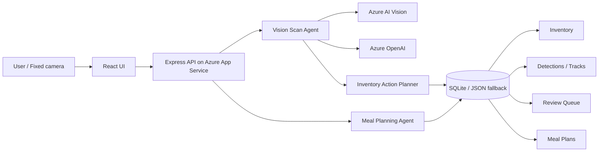

# KitchenOps Agent

固定カメラで食材の入庫・使用を観測し、在庫DBを更新しながら、1週間の献立と買い足しリストまで作る AI エージェントです。

Microsoft Agent Hackathon powered by Tokyo Electron Device 向けの提出プロジェクトとして、Azure App Service 上で公開しています。

## 公開URL

- Webアプリ: https://kitchenops-agent-yuuya-20260601.azurewebsites.net
- GitHub: https://github.com/yuuyle/kitchenops-agent

## できること

- 固定カメラ映像から食材を自動スキャン
- Azure AI Vision で画像の caption / tags / objects を抽出
- Azure OpenAI で Vision signals を食材カタログの `canonicalName` へ正規化
- 食材の登録、数量加算、使用、削除を在庫DBへ反映
- 連続フレームをトラッキングIDで集約し、重複登録を抑制
- 信頼度が低い候補を確認キューへ回す Human-in-the-loop
- 在庫、家族構成、好み、栄養目標、調理時間、予算を考慮した1週間の献立生成
- レシピ詳細と買い足しリストの表示
- カメラが使えない環境向けのデモ入力フォールバック

## デモで見るポイント

1. カメラ画面で `Azure AI` 表示、または Azure OpenAI / Azure AI Vision が configured であることを確認します。
2. 自動スキャンをONにしたまま、バナナ、トマト、じゃがいも、キャベツ、牛乳などを1種類ずつカメラ枠内に映します。
3. 検出履歴に `Azure AI Vision:` と `Azure OpenAI:` の判定根拠が表示されます。
4. 在庫タブで数量が追加・増加することを確認します。
5. 献立生成を押すと、在庫を考慮した1週間の献立、レシピ、買い足しリストが生成されます。
6. 使用モードで同じ食材を映すと、在庫数量が減ります。

ステップ・バイ・ステップの操作手順は [docs/operation_guide.md](docs/operation_guide.md) を参照してください。

## アーキテクチャ



## 技術構成

- Frontend: React, TypeScript, Vite
- Backend: Express, Node.js
- AI: Azure AI Vision, Azure OpenAI
- Hosting: Azure App Service on Linux
- Persistence: SQLite, JSON fallback
- CI/CD: GitHub Actions

## ローカル起動

```bash
npm install
npm run dev
```

- Web: http://localhost:5173
- API: http://localhost:8787

Azure AI の疎通確認:

```bash
npm run test:azure-ai
```

`.env.azure-ai.local` に Azure OpenAI / Azure AI Vision の接続情報を設定すると、ローカルでも実AI経路を確認できます。

## 本番ビルド

```bash
npm run build
$env:NODE_ENV='production'; npm start
```

App Service では `npm start` により `dist-server/server/index.js` を起動し、Express が `/api/*` と React の `dist` を同時に配信します。

## 主要な環境変数

- `NODE_ENV=production`
- `KITCHEN_DATA_DIR=/home/data/kitchenops-agent`
- `WEBSITES_CONTAINER_START_TIME_LIMIT=600`
- `APP_PUBLIC_ORIGIN`
- `ALLOW_VISION_IMAGE_URL=false`
- `AZURE_OPENAI_ENDPOINT`
- `AZURE_OPENAI_API_KEY`
- `AZURE_OPENAI_DEPLOYMENT`
- `AZURE_OPENAI_API_VERSION`
- `AZURE_AI_VISION_ENDPOINT`
- `AZURE_AI_VISION_API_KEY`
- `AZURE_AI_VISION_API_VERSION`

## 公開デモのセキュリティ

- Azure の接続キーや Publish Profile は GitHub に含めず、App Service / GitHub Actions のシークレットで管理します。
- 本番では CORS を同一オリジンに制限し、主要なセキュリティヘッダーを付与します。
- `/api/vision/scan` などの更新系APIには簡易レート制限を入れています。
- 外部画像URLを渡す Vision スキャンは、公開環境では `ALLOW_VISION_IMAGE_URL=false` のままにします。
- この提出版は公開デモ用のため、入力した在庫・家族設定は公開データとして扱ってください。実運用化する場合はユーザー認証とユーザー別DB分離を追加します。

## ドキュメント整理

審査員向けに読んでほしい情報は、この README に集約しています。

作業メモ、質問、提出準備メモ、録画台本、旧仕様書、詳細アーキテクチャ案などは公開対象から外し、ローカルの `tmp/docs-internal/` に退避しています。
