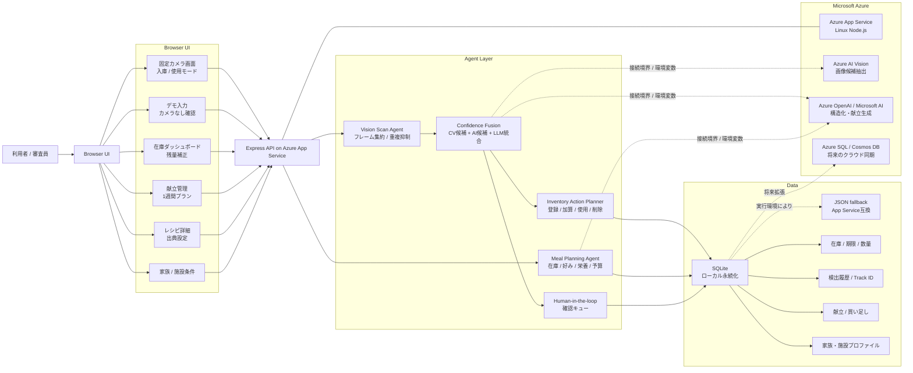

# KitchenOps Agent アーキテクチャ図

Zenn記事には以下の Mermaid 図を画像化、または Mermaid 対応環境でそのまま貼り付ける。

## 図で強調すること

- 観測、判断、記憶、行動、自己補正を持つ Agentic AI として説明する
- Azure App Service で実行されていることを明示する
- Azure AI Vision / Azure OpenAI は接続境界と画面上の状態表示を実装済みであることを説明する
- 認識が不確実な場合は確認キューへ回し、現場運用を止めない設計であることを示す
- クラウド同期は Azure SQL / Cosmos DB へ拡張する構成として示す
