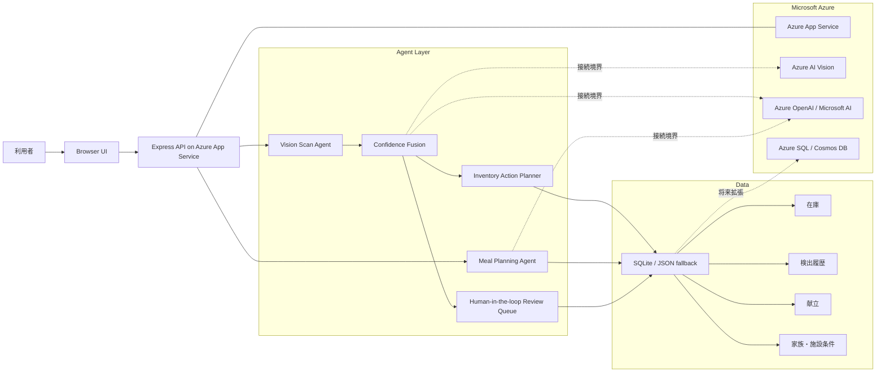

# 冷蔵庫前カメラで食材在庫と献立を自律運用する KitchenOps Agent

この記事は Microsoft Agent Hackathon powered by Tokyo Electron Device への提出記事ドラフトです。

## 成果物

- Webアプリ: https://kitchenops-agent-yuuya-20260601.azurewebsites.net
- GitHub: TODO
- デモ動画: TODO

## なぜ作ったか

食材管理は、入力作業が発生した瞬間に続かなくなりやすい。

家庭だけでなく、小規模飲食店、保育施設、介護施設、社員食堂のような現場でも、食材の入庫、期限、在庫数、献立、買い足しは日々発生する。ところが、これらは紙、記憶、担当者の経験に寄りがちで、次のような問題につながる。

- 冷蔵庫にある食材を把握できず、重複購入が起きる
- 期限切れや食品ロスが発生する
- 献立作成と買い足しリスト作成に時間がかかる
- 栄養や好み、調理負荷まで考慮すると属人化する
- 認識や入力が間違った時に運用が止まりやすい

KitchenOps Agent は、この「手入力が続かない」という根本課題を、固定カメラとAIエージェントで解くことを狙ったアプリケーションである。

## KitchenOps Agent の体験

利用者は、買ってきた食材を冷蔵庫前の固定カメラに通す。明示的に写真撮影するのではなく、動画フレームを定期的に読み取り、食材候補を検出する。

アプリは検出結果を在庫DBに反映し、同じ食材が短時間に連続して映った場合はトラッキングIDで集約する。信頼度が低いものや運用上確認したいものは、確認キューへ回す。

在庫が揃ったら、家族構成、好み、栄養目標、調理時間、予算を考慮して、1週間の献立と買い足しリストを生成する。調理時は「使用」モードに切り替え、使った食材を同じカメラに通すことで在庫を減算する。使用後の残量は在庫画面から補正できる。

審査員がカメラを使えない環境でも試せるよう、カメラ画面にはデモ入力ボタンを用意している。

## アーキテクチャ

アプリケーションは React + Express + Node.js で構成し、Azure App Service on Linux にデプロイした。

詳細版の図は `docs/architecture.md` に整理している。

## Agentic AI としての設計

KitchenOps Agent は、単なる献立生成ではなく、食材オペレーションを観測から計画まで回すエージェントとして設計した。

- 観測: 固定カメラの動画フレームから食材通過を検出する
- 判断: CV信号、画像認識候補、LLMによる構造化候補を統合する
- 記憶: 在庫、期限、家族/施設条件、レシピソース設定、検出履歴を保存する
- 行動: 在庫登録、加算、使用、削除、確認キュー作成、献立生成、買い足しリスト作成を行う
- 自己補正: 不確実な認識は確認キューへ回し、残量入力で現場補正できる

現場導入では、AIが100%正しく認識することよりも、間違いが起きても運用が止まらないことが重要である。そのため、確認キューと残量補正を最初からUIに入れた。

## 画像認識パイプライン

現在のデモでは、APIキーなしで動く mock 認識を使っている。ただし、画面とAPIには Azure OpenAI / Azure AI Vision / OpenAI API の接続状態を表示する境界を実装済みである。

想定する本番パイプラインは以下の通り。

1. 固定カメラの動画フレームを取得
2. ROI、色、輪郭、移動領域などのCV信号を抽出
3. Azure AI Vision で食材候補を抽出
4. Azure OpenAI で候補を構造化し、食材名、数量、単位、信頼度へ変換
5. トラッキングIDと短時間重複抑制で連続フレームを集約
6. 信頼度が閾値以下なら確認キューへ回す
7. 在庫DBへ登録、加算、使用、削除を反映

## 献立生成

献立生成では、現在の在庫、期限、家族構成、好み、栄養目標、調理時間、予算を考慮する。

生成結果は、1週間分の朝・昼・夜の献立、在庫でまかなえる割合、買い足しリストとして表示される。レシピ詳細画面では材料、手順、栄養目安、Web検索元へのリンクを確認できる。

## Microsoft Azure の利用

提出アプリは Azure App Service 上で稼働している。

- Azure App Service: React + Express + Node.js のアプリケーション実行基盤
- Azure OpenAI / Azure AI Vision: 接続境界と環境変数、管理画面の状態表示を実装
- Azure SQL / Cosmos DB: クラウド同期の将来拡張先として設計

App Service のNodeランタイム差異に備えて、SQLiteが利用できない場合はJSON永続化へ自動フォールバックするようにした。これにより、審査期間中にアプリが起動不能になるリスクを下げている。

## 工夫した点

- カメラがなくても審査員が試せるデモ入力
- 連続フレームをトラッキングIDで集約する設計
- 信頼度が低い候補を確認キューへ逃がす Human-in-the-loop
- 使用後の残量補正
- Azure App Service での本番配信
- Microsoft AI 接続状態を画面に明示

## 今後の拡張

- Azure AI Vision / Azure OpenAI 実APIによる画像認識
- Azure SQL または Cosmos DB を使ったクラウド同期
- 日本食品標準成分表ベースの栄養計算
- バーコード / OCR / 賞味期限読み取り
- 施設ごとの複数端末運用
- 発注システム連携

## まとめ

KitchenOps Agent は、食材在庫を手入力するのではなく、固定カメラで観測し、AIが在庫、献立、買い足し、確認キューまでつなげるアプリケーションである。

献立を作るだけではなく、食材オペレーションそのものを回すエージェントとして、食品ロス削減、発注漏れ防止、献立作成時間の削減を目指している。
